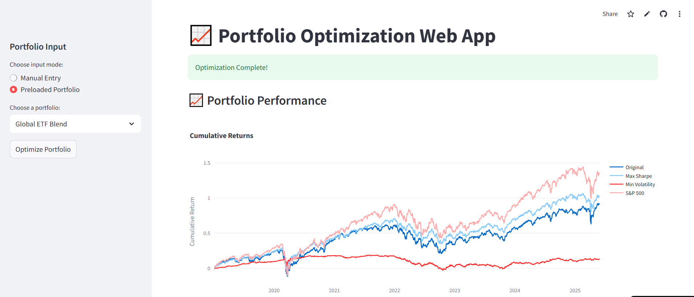

# 📊 Portfolio Optimization Demo App

A minimal yet powerful portfolio analytics app designed to showcase optimization techniques in quantitative finance. This Streamlit app compares original portfolio allocations against two optimized strategies — maximum Sharpe ratio and minimum volatility — with benchmark comparisons and sleek visualizations.

---

## 🚀 Features

- 📈 **Cumulative Return Visualization**  
  Compare performance of original, optimized, and benchmark portfolios over time.

- 🧮 **Metrics Table**  
  Annualized return, volatility, and Sharpe ratio for each strategy at a glance.

- 🧩 **Portfolio Allocation Viewer**  
  Tabbed pie charts showing asset allocations for original and optimized portfolios.

- 🏦 **Benchmark Comparison**  
  Includes S&P 500 for context and performance grounding.

---

## 🧠 Tech Stack

- Python (Pandas, NumPy, SciPy)
- Streamlit
- Plotly (for graphs)
- Yfinance
---

## ⚙️ Getting Started

To run the app locally:

```bash
git clone https://github.com/yourusername/portfolio-optimizer-demo.git
cd portfolio-optimizer-demo
pip install -r requirements.txt
streamlit run app/main.py
```

## 🌍 Live Demo
🔗 Click here to launch the app ([link to the app](https://portfolio-optimization-demo-app.streamlit.app/))

## 📸 Screenshot


## 📄 License
MIT License. Use, break, or improve, just don’t sell it to Goldman Sachs without telling me.

## 🤝 Let's Connect
If you're a recruiter or hiring manager, feel free to reach out.
This demo is just the beginning.